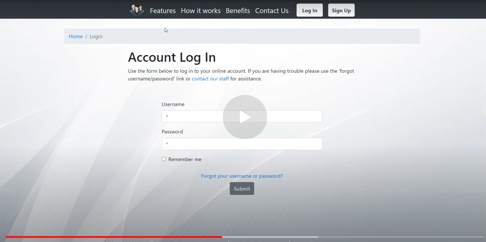

## Employee Tracker - software for tracking productivity of remote employees

The project is comprised of desktop(client) and web applications. The first one is used to collect data from employees when they are working, whereas the other one is for monitoring 
the gathered data. Built with <code>Qt, Django(Channels, REST framework)</code> and <code>React</code>.

## Project Status

This project is currently in development.

### Features:
#### Client application
  - [x] Authorization (only employee users can log in)
  - [x] Websocket connection for real time data transfers
  - [x] Internet traffic analysis(HTTP/SSL/TLS packets)  
  - [x] Screen shots collection
  - [x] Idle prompts when a user shows no activity
  
#### Web application
  - [x] Authorization (log in, sign up, password reset)
  - [x] User profile/account pages 
  - [x] Your projects page (for staff members only). Ability to create new projects, add new members and view existing ones. 
  - [x] Real time updates when an employee's connection status(online, offline, etc) changes.
  - [x] Employee activity logs page (visualization of data collected by client app) 
  
## Project Video Demo

## Installation and Setup Instructions

TODO

## Reflection

This was an over a month long pet project built during 2020's summer. Project's main goals were consolidating skills in Python, JavaScript, HTML/CSS languages, as well as going through all stages of software development lifecycle.  

Originally I wanted to build a free solution that allowed business clients to be able to watch what their employees do during the job. I started this process by developing client 
application, then planning database architecture and moving to web application to visualize the collected data.  

One of the main challenges I ran into was Networking features. This lead me to spend a few days on a research spike into TCP/IP network model, what data is used on each 
layer of it, application protocols and means to implement this knowledge in practice. 

At the end of the day, the technologies implemented in this project are <code>Qt, Django(with Channels and REST framework), Webpack, React, React-Router 5.0, Axios, HTML, CSS(Reactstrap)</code>. 

